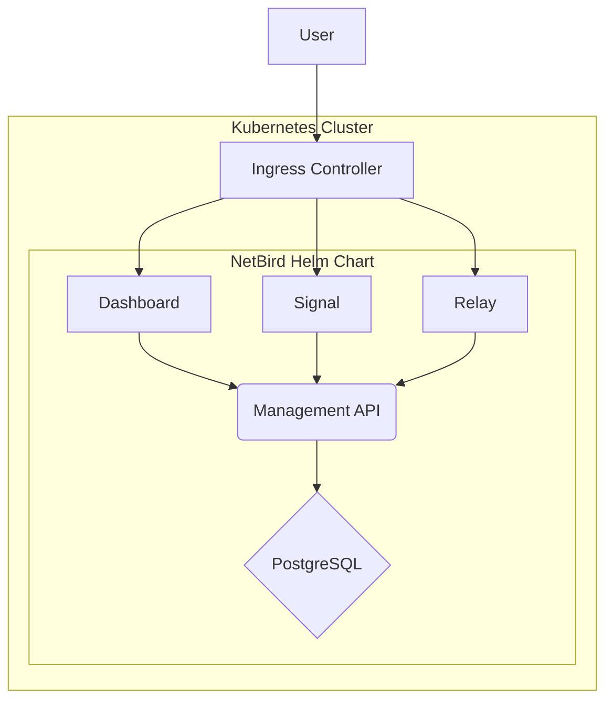

# NetBird Helm Chart

This Helm chart deploys NetBird on a Kubernetes cluster using subcharts for each component.

## Architecture



## Prerequisites

- Kubernetes 1.19+
- Helm 3.2.0+
- PV provisioner support in the underlying infrastructure (if persistence is enabled for the management subchart)

## Chart Structure

This chart is composed of several subcharts:

- **dashboard**: NetBird Dashboard UI
- **management**: NetBird Management API
- **signal**: NetBird Signal Server
- **relay**: NetBird Relay Server
- **postgresql-cnpg**: Cloud Native PostgreSQL (optional)

## Configuration Management

This chart separates configuration into two categories:

- **Non-sensitive configuration**: Stored in a ConfigMap (`<release-name>-config`) in the management subchart
- **Sensitive configuration**: Stored in a Secret (`<release-name>-secrets`) in the management subchart

All components (dashboard, management, signal, relay) use the `envFrom` feature to mount these ConfigMap and Secret resources, providing a clean and consistent configuration approach across all components.

### ConfigMap

The ConfigMap contains non-sensitive configuration such as:
- Timezone (TZ)
- NetBird API endpoints (NETBIRD_MGMT_API_ENDPOINT, NETBIRD_MGMT_GRPC_API_ENDPOINT)
- Auth configuration (AUTH_AUTHORITY, AUTH_AUDIENCE, AUTH_CLIENT_ID, etc.)
- Relay configuration (NB_LISTEN_ADDRESS, NB_EXPOSED_ADDRESS)
- Store configuration (NETBIRD_STORE_ENGINE, NB_ACTIVITY_EVENT_STORE_ENGINE)

### Secrets

The Secret contains sensitive configuration such as:
- Auth client secret (AUTH_CLIENT_SECRET)
- Relay authentication secret (NB_AUTH_SECRET)
- PostgreSQL password (POSTGRES_PASSWORD)
- Complete PostgreSQL DSN strings (NETBIRD_STORE_ENGINE_POSTGRES_DSN, NB_ACTIVITY_EVENT_POSTGRES_DSN)

## Installing the Chart

To install the chart with the release name `my-netbird`:

```bash
helm install my-netbird ./netbird-chart
```

## Uninstalling the Chart

To uninstall/delete the `my-netbird` deployment:

```bash
helm uninstall my-netbird
```

## Configuration

The following table lists the configurable parameters of the NetBird chart and their default values.

### Global Parameters

| Parameter | Description | Default |
|-----------|-------------|---------|
| `global.timezone` | Timezone for all containers | `"UTC"` |

### NetBird Configuration

| Parameter | Description | Default |
|-----------|-------------|---------|
| `global.netbird.fqdn` | NetBird FQDN (used for dashboard access and ingress) | `"netbird.example.com"` |
| `global.netbird.relay.secret` | NetBird relay secret | `"netbird"` |

### Ingress Configuration

This chart uses a global ingress configuration that can be overridden by each subchart.

| Parameter | Description | Default |
|-----------|-------------|---------|
| `global.netbird.ingress.enabled` | Enable ingress for all components | `true` |
| `global.netbird.ingress.className` | Ingress class name | `"nginx"` |
| `global.netbird.ingress.tls.enabled` | Enable TLS | `false` |
| `global.netbird.ingress.tls.secretName` | TLS secret name | `""` |
| `global.netbird.management.ingress.http.host`| Management HTTP ingress host | `"http.management.netbird.example.com"` |
| `global.netbird.management.ingress.grpc.host`| Management gRPC ingress host | `"grpc.management.netbird.example.com"` |
| `global.netbird.signal.ingress.host`| Signal ingress host | `"signal.netbird.example.com"` |
| `global.netbird.relay.ingress.host`| Relay ingress host | `"relay.netbird.example.com"` |


### Auth Configuration

| Parameter | Description | Default |
|-----------|-------------|---------|
| `global.auth.authority` | Auth authority URL | `"https://<keycloak.fqdn>/realms/<keycloak.realm>"` |
| `global.auth.audience` | Auth audience | `"netbird-client"` |
| `global.auth.clientId` | Auth client ID | `"netbird-client"` |
| `global.auth.clientSecret` | Auth client secret | `""` |
| `global.auth.supportedScopes` | Auth supported scopes | `"openid"` |
| `global.auth.tokenSource` | Auth token source | `"accessToken"` |

### PostgreSQL Configuration

| Parameter | Description | Default |
|-----------|-------------|---------|
| `global.postgresql.external.enabled` | Use external PostgreSQL | `false` |
| `global.postgresql.external.host` | External PostgreSQL host | `"postgres.example.com"` |
| `global.postgresql.external.port` | External PostgreSQL port | `5432` |
| `global.postgresql.external.user` | External PostgreSQL user | `"postgres"` |
| `global.postgresql.external.password` | External PostgreSQL password | `""` |
| `global.postgresql.external.database` | External PostgreSQL database | `"postgres"` |
| `global.postgresql.cnpg.enabled` | Use CNPG PostgreSQL | `true` |
| `global.postgresql.cnpg.instances` | Number of CNPG instances | `1` |
| `global.postgresql.cnpg.resources` | CNPG resources | See values.yaml |
| `global.postgresql.cnpg.storage.size` | CNPG storage size | `"1Gi"` |
| `global.postgresql.cnpg.storage.storageClass` | CNPG storage class | `""` |
| `global.postgresql.cnpg.backup.enabled` | Enable CNPG backups | `true` |
| `global.postgresql.cnpg.backup.schedule` | CNPG backup schedule | `"0 3 * * *"` |

### Subchart Configuration

Each subchart (dashboard, management, signal, relay) has its own values.yaml file with detailed configuration options. The main values.yaml file only contains the `enabled` flag for each subchart.

| Parameter | Description | Default |
|-----------|-------------|---------|
| `dashboard.enabled` | Enable dashboard component | `true` |
| `management.enabled` | Enable management component | `true` |
| `signal.enabled` | Enable signal component | `true` |
| `relay.enabled` | Enable relay component | `true` |

For detailed configuration of each subchart, please refer to their respective values.yaml files:
- `charts/dashboard/values.yaml`
- `charts/management/values.yaml`
- `charts/signal/values.yaml`
- `charts/relay/values.yaml`